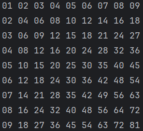

# Multiplication Table Project

This project generates a multiplication table using different methods in Python. The methods include using for loops, while loops, list comprehensions, and recursion.



## Methods

### For Loop Method
Generates the multiplication table using nested for loops.
```python
for_loop_method()
```
While Loop Method
Generates the multiplication table using nested while loops.
```python
while_loop_method()
```
List Comprehension Method
Generates the multiplication table using list comprehensions.
```python
list_comprehension_method()
```
Recursion Method
Generates the multiplication table using recursion.
```python
recursion_method()
```
